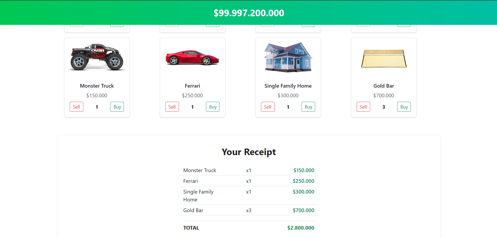

# 💸 Spend Bill Gates' Money - React Klon Uygulaması

Bu proje, [neal.fun/spend](https://neal.fun/spend) sitesinin bir klonudur. Kullanıcının hayali ürünler satın alarak Bill Gates'in 100 milyar dolarlık servetini harcamasını sağlar. Uygulama **React** ile geliştirilmiştir.

---

## 🎯 Proje Amacı

> Hayali ürünleri kullanarak Bill Gates’in $100,000,000,000 parasını harcamak.  
> Ürün satın alındıkça bakiye azalır, ürün satıldıkça artar.  
> Bakiye kontrolü, buton engelleme, sepet özeti gibi tüm işlevler çalışır durumdadır.

---

## 🖼️ Uygulama Görseli

> Aşağıdaki gibi ürünler listelenir ve satın alındıkça bakiye güncellenir:



---

## ✅ Özellikler

- Başlangıç bakiyesi: **$100.000.000.000**
- Ürün listesi: Görsel, isim ve fiyat bilgileriyle
- Satın alma & satış işlemleri
- Bakiyeye göre butonların aktif/pasif olması
- Alınan ürünlerin en altta adet ve toplam tutarla listelenmesi (Sepet özeti)
- Satın alım sonrası bakiyenin dinamik güncellenmesi

---

## 📁 Klasör Yapısı

```bash
├── public
├── src
│   ├── components
│   │   ├── Header.jsx
│   │   ├── ProductItem.jsx
│   │   ├── ProductList.jsx
│   │   └── Cart.jsx
│   ├── data
│   │   └── products.js
│   ├── App.jsx
│   ├── App.css
│   └── index.js
├── README.md

---

## 🧠 Kullanılan Teknolojiler

- React (Vite ile yapılandırıldı)

- Bootstrap (Butonlar, grid yapısı, stil desteği için)

- CSS (Özelleştirilmiş stil tanımları)

- useState (Yerel durum yönetimi)

---


