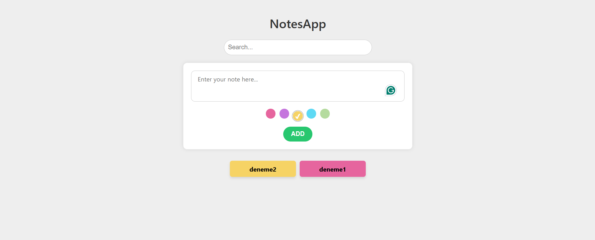

# 📝 NotesApp - React

Bu proje, kullanıcıların renkli notlar alabileceği, notları filtreleyebileceği basit ama işlevsel bir not uygulamasıdır. React ve Vite kullanılarak geliştirilmiştir.

---

## 🚀 Özellikler

- 🖊️ Yeni not ekleme
- 🎨 Renk seçme özelliği
- 📌 Seçilen renge göre notun arka planı belirlenir
- 🔍 Gerçek zamanlı arama (filtreleme)
- 📱 Duyarlı (responsive) tasarım

---

## 📸 Ekran Görüntüsü

---

## 📁 Dosya Yapısı
pgsql
Kodu kopyala
note-app/
├── public/
├── src/
│   ├── components/
│   │   ├── NoteInput.jsx
│   │   └── NoteList.jsx
│   ├── App.jsx
│   ├── main.jsx
│   └── index.css
├── index.html
├── README.md
├── screenshot.png
├── package.json
└── vite.config.js

---

## 🛠️ Kullanılan Teknolojiler
React

Vite

JavaScript (ES6+)

CSS3

---

## 👩‍💻 Geliştirici
Sena Nur Durna
