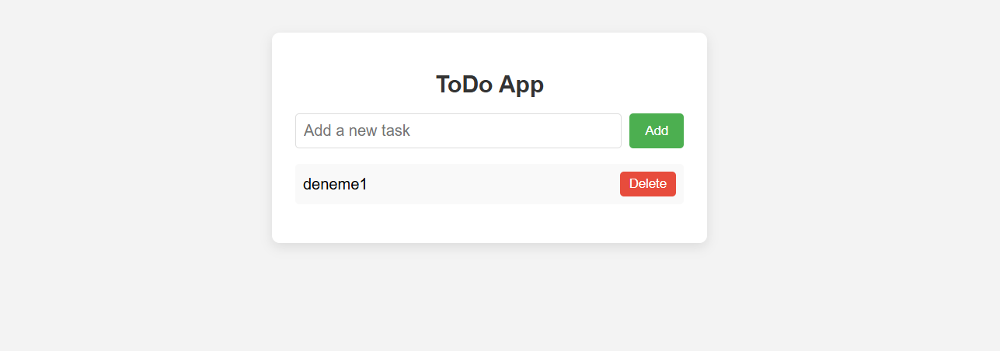

# 📝 ToDo App – React ile Görev Takip Uygulaması

Bu proje, basit ve işlevsel bir yapılacaklar listesi (ToDo App) uygulamasıdır. React kullanılarak geliştirilmiştir. Kullanıcılar görev ekleyebilir, silebilir ve sayfa yenilense bile görevler localStorage sayesinde kaybolmaz.

## 🔧 Kullanılan Teknolojiler

- React (Vite ile oluşturuldu)
- HTML & CSS (CodePen'den alınan tasarım referans alınmıştır)
- JavaScript (ES6+)
- Local Storage

## 🚀 Özellikler

- 📌 Yeni görev ekleme
- ❌ Mevcut görevi silme
- 🔁 Sayfa yenilense bile görevlerin korunması (`localStorage` kullanılarak)
- ✅ "Görev eklendi!" bildirimi (otomatik kaybolur)
- 🎨 Şık ve sade kullanıcı arayüzü

## 🖼️ Ekran Görüntüsü

