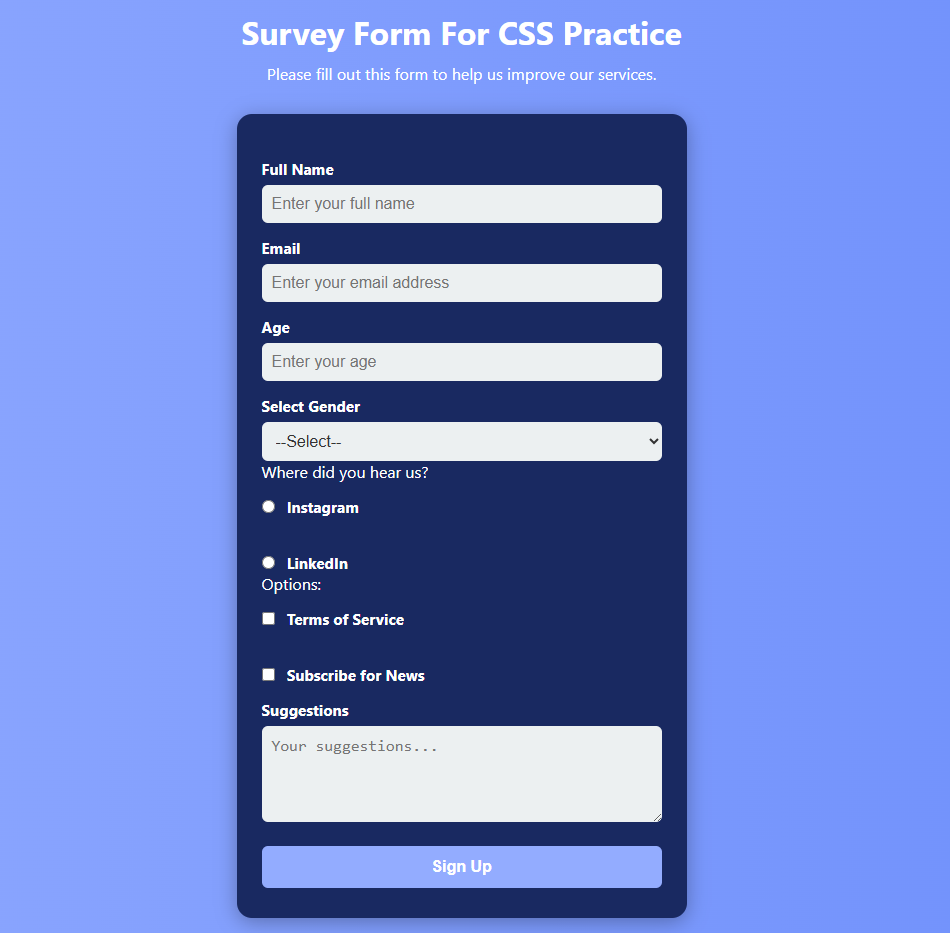

# 📝 Survey Form - CSS Practice

This is a simple and modern **survey form web page** built using **HTML and CSS** as part of a practice project. It is designed to meet specific assignment criteria, including form validation, input types, labels, and styling through a separate CSS file.

---

## 🔧 Project Features

✅ Responsive layout  
✅ Clean and modern CSS design  
✅ HTML5 form validation  
✅ Accessible form structure  
✅ Custom dropdown, radio, checkbox, and textarea  
✅ Styled using external CSS (`style.css`)

---

## 📂 Folder Structure
week2-Registration Form/
├── index.html # Main HTML file with the form
└── style.css # External stylesheet with modern styling

---

## 📋 Form Fields & Requirements

This project includes the following elements:

- `<h1 id="title">` – Page title  
- `
` – Description paragraph  
- `<form id="survey-form">` – Form wrapper  
- `<input id="name" type="text">` – Name input with placeholder  
- `<input id="email" type="email">` – Email input with HTML5 validation  
- `<input id="number" type="number">` – Age input with min/max  
- `<label>` elements for all inputs with proper `for` attributes  
- `<select id="dropdown">` – Gender selection dropdown  
- `<input type="radio" name="source">` – Radio buttons for source  
- `<input type="checkbox">` – Checkbox options  
- `<textarea>` – Suggestions/Comments  
- `<input id="submit" type="submit">` – Submit button

---

## 🛠 Technologies Used

- HTML5
- CSS3 (external stylesheet)

---

## 🌐 Live Demo

[🔗 View the Live Form Here](https://senanurdurna.github.io/frontend-bootcamp/week2-Registration%20Form/)

---

## 🖼️ Screenshot

Below is a preview of the final form:

