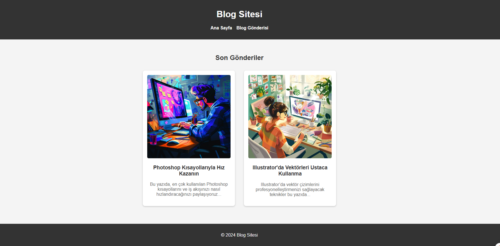

# Ödev 1 - Blog Sitesi Tasarlama

Bu proje, HTML ve CSS kullanılarak oluşturulmuş basit bir blog sitesidir. İçerik teması olarak **Photoshop ve Illustrator ipuçları** ele alınmıştır.

## 📁 Dosya Yapısı

grafik-blogu/
├── index.html # Ana sayfa – blog özetleri listeleniyor
├── post.html # Blog detay sayfası
├── styles.css # Ortak stil dosyası
└── README.md # Bu dosya

## 🧰 Kullanılan Teknolojiler

- HTML5  
- CSS3  
- Responsive temellere uygun yapı  
- Flexbox ile kart düzeni  

## 🎯 Özellikler

- Menü çubuğu ile kolay gezinme
- Kart şeklinde blog gönderileri
- Öne çıkan içerikler için özel "bonus" stili
- Modern tasarım ve sade tipografi
- Renk paleti ve yazı tipi yönergelere uygun

## 🎨 Renk Paleti

| Alan                | Renk Kodu  |
|---------------------|------------|
| Arka Plan           | `#f4f4f4`  |
| Başlık/Footer       | `#333`     |
| Başlık Yazı Rengi   | `#333`     |
| Paragraf Yazı Rengi | `#666`     |
| Bonus Kutusu        | `#fffbe6`  |
| Bonus Çizgi         | `#fdbb2d`  |

## 🌐 Canlı Demo

[🔗 Siteyi Görüntüle](https://senadurna.github.io/frontend-bootcamp/week2/week2-blog-sitee/)

---

## 🖼️ Ekran Görüntüsü

Aşağıda blog sitesinin ekran görüntüsünü bulabilirsiniz:

