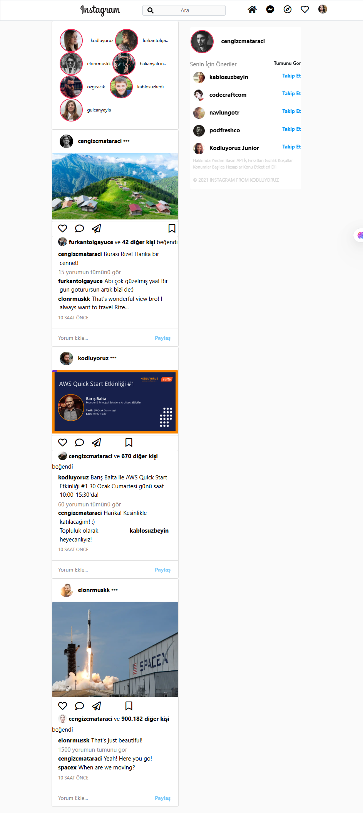

# Instagram Clone – Bootstrap Projesi

Bu proje, [Kodluyoruz Bootstrap Ödevi #2](https://github.com/Kodluyoruz/taskforce/tree/main/bootstrap/odev2) kapsamında oluşturulmuştur. Gerçek Instagram arayüzü referans alınarak responsive ve fonksiyonel bir arayüz klonlanmıştır.

## 🚀 Kullanılan Teknolojiler

- HTML5
- CSS3
- Bootstrap 4
- Font Awesome
- JavaScript (img fallback özelliği için)

## 🔧 Özellikler

- Sabit ve responsive navbar
- Arama çubuğunda ikon destekli placeholder
- Sticky sağ panel
- Mobilde gizlenen ikonlar ve responsive yapı
- Grid sistemi ile responsive orta içerik alanı
- Placeholder resmi olmayan profiller için rastgele avatar atama
- Instagram’a benzer arayüz ve etkileşimli ikonlar

## 🖼️ Proje Önizlemesi

## 🔗 Kaynaklar

- [Bootstrap](https://getbootstrap.com/)
- [Font Awesome](https://fontawesome.com/)
- [Kodluyoruz GitHub](https://github.com/Kodluyoruz)

## 🌐 Canlı Demo

[🔗 Siteyi Görüntüle](https://senadurna.github.io/frontend-bootcamp/week3/instagramclone/)