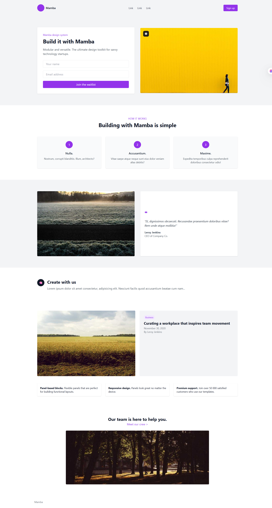

# TailwindCSS Landing Page

Bu projede, TailwindCSS kullanılarak modern ve responsive bir landing page tasarlanmıştır.

## Özellikler

- TailwindCSS CDN kullanılarak stil verilmiştir
- Responsive grid ve flex yapıları ile mobil uyumlu
- Picsum üzerinden alınan rastgele görseller kullanılmıştır
- Referans bir tasarım birebir uygulanmıştır

## Sayfa Bölümleri

1. Navbar (logo + linkler + buton)
2. Hero bölümü (form + görsel)
3. Bilgi kartları ("How it works")
4. Testimonial alanı
5. Create with us metin alanı
6. Blog kartı + görsel
7. Özellik kutucukları (panel, responsive, support)
8. Takım bölümü ("Our team is here to help you")
9. Footer (sade sosyal ikonlar ve başlık)

## Kullanılan Teknolojiler

- HTML5
- TailwindCSS (CDN)
- Görseller: [https://picsum.photos](https://picsum.photos)

## Ekran Görüntüsü

