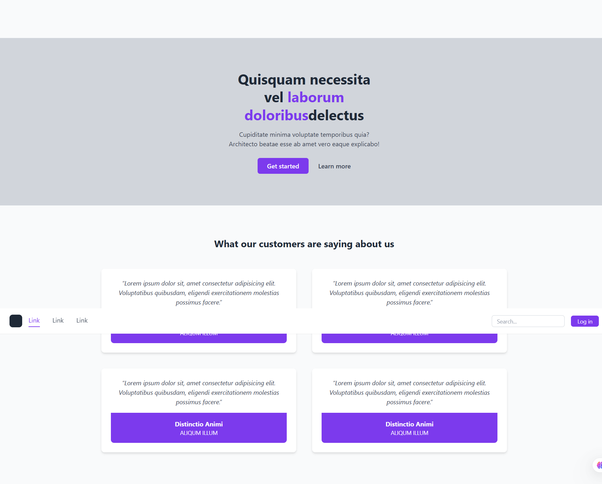

# TailwindCSS Review Page

Bu sayfa, modern bir kullanıcı arayüzü sunmak için TailwindCSS kullanılarak oluşturulmuştur. Sayfada sabit bir navigasyon bar, büyük bir başlık alanı, çağrı butonları ve müşteri yorumlarını içeren kart yapısı yer almaktadır.

## 🚀 Özellikler

- Responsive tasarım
- TailwindCSS kullanımı (CDN üzerinden)
- Sticky header (sayfa aşağı kaydırıldığında menü sabit kalır)
- Grid yapısıyla düzenlenmiş testimonial kartları

## 🖼️ Ekran Görüntüsü

## 🛠️ Kullanılan Teknolojiler

- HTML5
- TailwindCSS (CDN)

## 📁 Klasör Yapısı

TailwindCSS-ReviewPage
│
├── image/
│ └── screenshot.png
├── index.html
└── README.md

