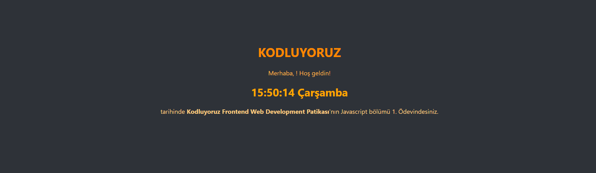

# Kodluyoruz JavaScript Ödevi 1 – Saat ve Karşılama

Bu proje, kullanıcıdan isim alıp karşılama mesajı gösteren ve aynı zamanda canlı olarak saati ve günü ekranda gösteren basit bir web uygulamasıdır.

---

## 🚀 Proje Görseli

 

---

## 🛠 Kullanılan Teknolojiler

- HTML
- CSS
- JavaScript

---

## 📁 Dosya Yapısı
├── index.html → Ana HTML dosyası
├── style.css → Stil dosyası
└── script.js → JavaScript dosyası

---

## 💡 Özellikler

- Kullanıcıdan `prompt()` ile isim alınır.
- Girilen isim ekrana yazdırılır.
- Canlı saat her saniye güncellenerek ekranda gösterilir.
- Gün ismi Türkçe olarak ekranda yazdırılır.
- Basit ve şık bir arayüz tasarımı içerir.

---

