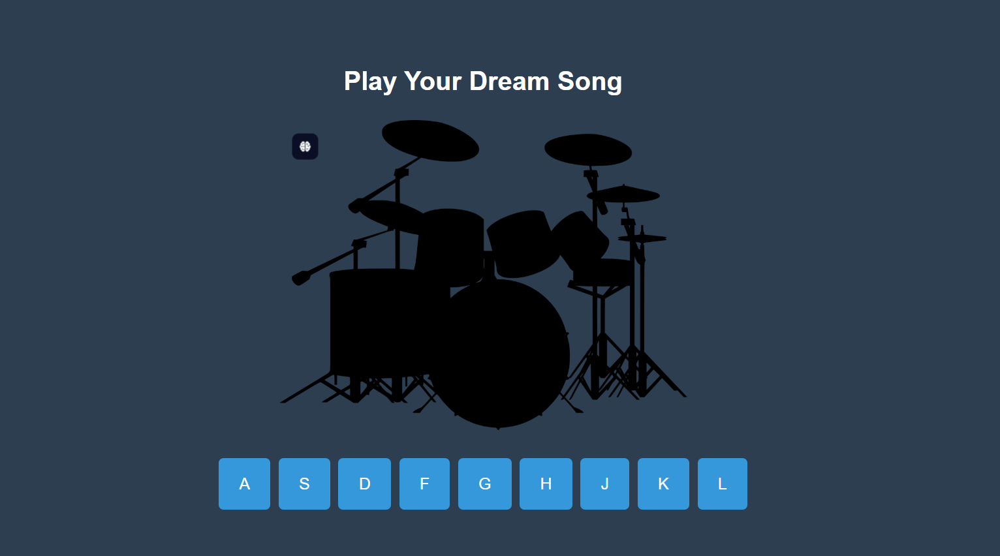

# 🥁 JavaScript Drum Kit

Bu proje, temel HTML, CSS ve JavaScript bilgileri kullanılarak hazırlanmış interaktif bir Drum Kit uygulamasıdır. Klavyeden veya butonlara tıklayarak farklı davul sesleri çalabilirsiniz.

## 🎯 Özellikler

- Klavye tuşları ile ses çalma (A–L arası)
- Tıklanabilir butonlar
- Her tuş için farklı ses dosyası
- Basıldığında animasyon efekti
- Responsive tasarım
- Temiz ve sade arayüz

## 🎵 Kullanılan Tuşlar ve Sesler

| Tuş | Ses         |
|-----|-------------|
| A   | Clap        |
| S   | HiHat       |
| D   | Kick        |
| F   | OpenHat     |
| G   | Boom        |
| H   | Ride        |
| J   | Snare       |
| K   | Tom         |
| L   | Tink        |

## 🚀 Canlı Demo

[Drum Kit'i Hemen Dene](https://senadurna.github.io/week5--Javascript-Drum-Kit/)

## 🖼️ Ekran Görüntüsü

---

## 📁 Proje Yapısı

drum-kit/
├── index.html
├── style.css
├── script.js
├── README.md
├── screenshot.png
├── drumset.png
└── sounds/
├── boom.wav
├── clap.wav
├── hihat.wav
├── kick.wav
├── openhat.wav
├── ride.wav
├── snare.wav
├── tink.wav
└── tom.wav

## 🛠️ Kullanılan Teknolojiler

- HTML5
- CSS3
- JavaScript (Vanilla)

