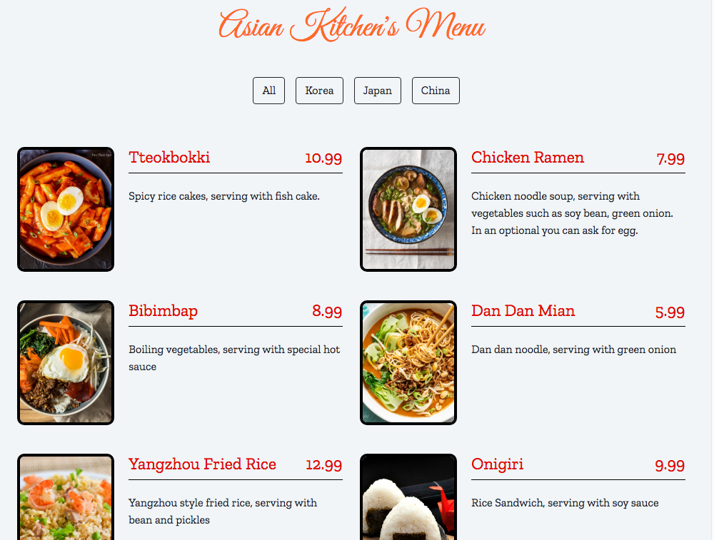

# 🍜 Asian Kitchen's Menu

Bu proje, JavaScript kullanılarak oluşturulmuş interaktif bir **Uzak Doğu restoran menü** uygulamasıdır. Menüdeki ürünler, filtreleme butonları aracılığıyla **ülkelere göre (Korea, Japan, China)** dinamik olarak listelenir.

## 🎯 Proje Özellikleri

- Menü içeriği JavaScript dizisi üzerinden tanımlanmıştır (`id`, `title`, `category`, `price`, `img`, `desc`)
- Kategori filtreleme butonları JavaScript ile **dinamik olarak oluşturulmuştur**
- **map()**, **reduce()**, **filter()** gibi modern JavaScript array metotları kullanılmıştır
- Sayfa yüklendiğinde tüm menü ürünleri gösterilir
- Bootstrap ile responsive tasarım
- Görsel olarak sade ve kullanıcı dostu bir arayüz

## 🛠 Kullanılan Teknolojiler

- HTML5
- CSS3
- JavaScript (Vanilla)
- Bootstrap 5
- Google Fonts

## 🖼 Ekran Görüntüsü

## 📁 Dosya Yapısı

├── index.html       
├── app.js           
├── style.css        
└── ss.png           
