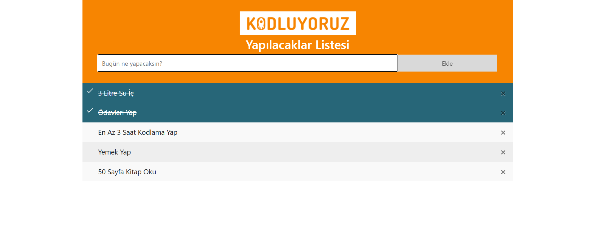

# ✅ JavaScript To Do List

Bu proje, günlük yapılacak işleri listelememizi sağlar. Görevler eklenebilir, tamamlandığında işaretlenebilir ve silinebilir.

---

## 🚀 Proje Özellikleri

- Görev ekleme  
- Görev üzerine tıklayarak **tamamlandı** olarak işaretleme  
- Görevi silme (çarpı butonu)  
- Boş görev eklenemez (**Toast** bildirim ile uyarı)  
- Başarıyla eklenen görev için **Toast** bildirimi  
- Bootstrap 4 ve CSS ile stil verilmiştir
- Tarayıcı kapansa bile görevlerin korunması (localStorage)
- Görevleri sıfırlayıp başa dönme (Varsayılana sıfırla butonu)

---

## 🖼️ Proje Görseli

## 📁 Dosya Yapısı
.
├── index.html 
├── style.css 
├── script.js 
└── README.md 

---

## 🛠️ Kullanılan Teknolojiler

- HTML5  
- CSS3  
- JavaScript  
- Bootstrap 4 (Toast bileşeni için)

---

## 🔄 Güncellemeler (Week 6)

- **localStorage entegrasyonu** eklendi. Artık görevler tarayıcıda saklanır, sayfa yenilense bile kaybolmaz.
- **Varsayılana sıfırlama butonu** eklendi. Bu buton ile tüm görevler silinir ve ilk tanımlı görevler tekrar yüklenir.
