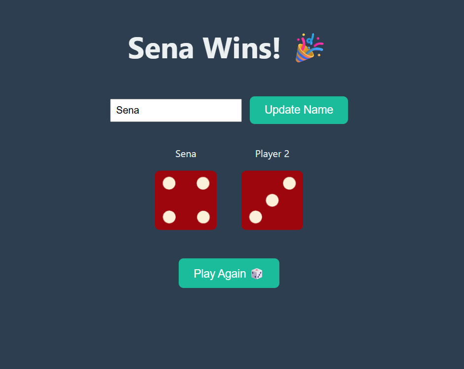

# 🎲 Dice Game

Bu proje, JavaScript kullanılarak geliştirilmiş basit bir zar oyunudur. Oyunda kullanıcı (Player 1) ve bilgisayar (Player 2) her turda bir kez zar atar. Her zar atışında 3 saniyelik animasyon gösterilir ve ardından her iki oyuncunun zar değerleri karşılaştırılarak sonuç ekrana yansıtılır. Oyuncu isterse kendi adını güncelleyebilir ve oyun tekrar oynanabilir.

---

## 🖼️ Proje Önizleme

---

## 🔗 Canlı Demo

👉 [Projeyi Görüntüle](https://senanurdurna.github.io/frontend-bootcamp/week9/Dice-Game/) 

---

## 💡 Özellikler

- 🎲 Her zar atışında 3 saniyelik gerçekçi zar animasyonu
- 🧑 Player 1 ismini güncelleme özelliği
- 🧠 Bilgisayara karşı oynama
- 🏆 Otomatik kazanan belirleme ve durum mesajı
- 🔁 “Tekrar Oyna” butonu ile sınırsız oyun döngüsü

---

## ⚙️ Kullanılan Teknolojiler

- **HTML5**  
- **CSS3**  
- **JavaScript (Vanilla)**

---

## 📁 Dosya Yapısı
Dice-Game/
├── images/
│ ├── dice1.png
│ ├── dice2.png
│ ├── dice3.png
│ ├── dice4.png
│ ├── dice5.png
│ └── dice6.png
├── Dice.png
├── index.html
├── style.css
└── script.js
